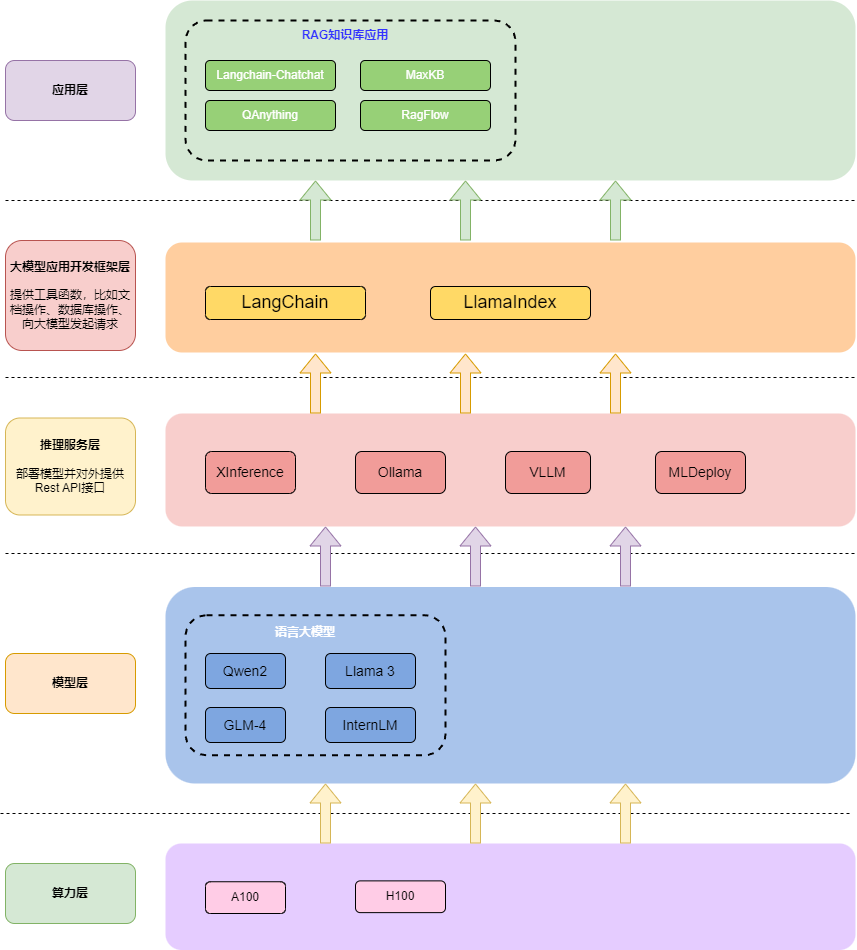

当前大模型应用的架构大致可分为五层，从上到下依次为：**应用层**、**大模型应用开发框架层**、**推理服务层**、**模型层、算力层**。

- **应用层**主要包含不同场景下的应用，常见的有**对话**、**基于向量的RAG知识库**、**Agent工作流**三大应用。除此之外，大模型在**推荐**、**搜索**等方向也被逐步应用。
- **大模型应用开发框架层**更多的是提供工具，比如文档解析、词向量化、数据库交互、调用模型API进行对话等，方便应用层快速开发。
- **推理服务层**旨在**管理**和**部署**各种模型，并对外提供**Rest API**接口，实现模型即服务。
- **模型层**即不同的模型权重。
- **算力层**代表不同的计算资源，如Nvidia显卡和AMD显卡。

# 应用层
## 基于向量的RAG知识库应用

---

|  RAG框架名称  |  GitHub地址  |  说明  | 技术栈 |  Star数 (统计日期：2024-09-01) |
| --- | --- | --- | --- | --- |
| **QAnything** | [https://github.com/netease-youdao/QAnything](https://github.com/netease-youdao/QAnything) | 网易开源的本地知识库应用。 | `Python`+`Fastchat` | `11.2k` |
| **RAGFlow** | [https://github.com/infiniflow/ragflow](https://github.com/infiniflow/ragflow) | an open-source RAG engine based on deep document understanding. | `Python`+`TypeScript` | `16k` |
| **AnythingLLM** | [https://github.com/Mintplex-Labs/anything-llm](https://github.com/Mintplex-Labs/anything-llm) | A full-stack application that enables you to turn any document, resource, or piece of content into context that any LLM can use as references during chatting. This application allows you to pick and choose which LLM or Vector Database you want to use as well as supporting multi-user management and permissions. | `JavaScript` | `19.4k` |
| **Langchain-Chatchat** | [https://github.com/chatchat-space/Langchain-Chatchat](https://github.com/chatchat-space/Langchain-Chatchat) | 基于 ChatGLM 等大语言模型与 Langchain 等应用框架实现，开源、可离线部署的 RAG 与 Agent 应用项目。 | `Python`+`TypeScript` | `31k` |
| **MaxKB** | [https://github.com/1panel-dev/MaxKB](https://github.com/1panel-dev/MaxKB) | 飞致云科技开源的一款知识库应用，可使用第三方API，支持工作流。 | `Python`+`VUE` | `9.4k` |
| **FastGPT** | [https://github.com/labring/FastGPT](https://github.com/labring/FastGPT) | FastGPT 是一个基于 LLM 大语言模型的知识库问答系统，提供开箱即用的数据处理、模型调用等能力。同时可以通过 Flow 可视化进行工作流编排，从而实现复杂的问答场景！ | `NextJs` + `TS` + ChakraUI + Mongo + Postgres (Vector 插件) | `16.7k` |
| **HuixiangDou** | [https://github.com/InternLM/HuixiangDou](https://github.com/InternLM/HuixiangDou) | InterLM开源的知识库问答框架。 | `Python`+`TypeScript` | `1.4k` |
| **RAG-GPT** | [https://github.com/gpt-open/rag-gpt](https://github.com/gpt-open/rag-gpt) | 
 | `Python`+`JavaScript` | `284` |

## Agent工作流框架

---

|  框架名称  |  GitHub地址  |  说明  | 技术栈 |  Star数 (统计日期：2024-09-01) |
| --- | --- | --- | --- | --- |
| **Dify** | [https://github.com/langgenius/dify](https://github.com/langgenius/dify) | Dify is an open-source LLM app development platform. Its intuitive interface combines AI workflow, RAG pipeline, agent capabilities, model management, observability features and more, letting you quickly go from prototype to production. | `Python`+`TypeScript` | `43.7k` |

## RAG技术研究

---

|  框架名称  |  GitHub地址  |  说明  | 技术栈 |  Star数 (统计日期：2024-09-01) |
| --- | --- | --- | --- | --- |
| **GraphRAG** | [https://github.com/microsoft/graphrag](https://github.com/microsoft/graphrag) | 基于图的知识增强检索框架，目前只有后端代码，更偏向于研究。 | `Python` | `16.4k` |

## RAG搜索框架

---

|  框架名称  |  GitHub地址  |  说明  | 技术栈 |  Star数 (统计日期：2024-09-01) |
| --- | --- | --- | --- | --- |
| **FlashRAG** | [https://github.com/RUC-NLPIR/FlashRAG](https://github.com/RUC-NLPIR/FlashRAG) | FlashRAG is a Python toolkit for the reproduction and development of Retrieval Augmented Generation (RAG) research. | `Python` | `1.1k` |

## 大模型对话前端框架

---

|  框架名称  |  GitHub地址  |  说明  | 技术栈 |  Star数 (统计日期：2024-09-01) |
| --- | --- | --- | --- | --- |
| **Open WebUI** | [https://github.com/open-webui/open-webui](https://github.com/open-webui/open-webui) | 大模型对话前端界面。 | `Python`+`JavaScript` | `37.4k` |

## 其他大模型应用

---

|  框架名称  |  GitHub地址  |  说明  | 技术栈 |  Star数 (统计日期：2024-09-01) |
| --- | --- | --- | --- | --- |
| **ChatBox** | [https://github.com/Bin-Huang/chatbox](https://github.com/Bin-Huang/chatbox) | Chatbox 是一个 AI 模型桌面客户端。 | `TypeScript` | `20.5k` |
| **Quivr** | [https://github.com/QuivrHQ/quivr](https://github.com/QuivrHQ/quivr) | Quivr, your second brain, utilizes the power of GenerativeAI to be your personal assistant ! Think of it as Obsidian, but turbocharged with AI capabilities. | `Python`+`TypeScript` | `35.8k` |

# **大模型应用开发框架层**

---

提供数据处理、与大模型通过API对话等工具能力，方便快速开发应用。

|  框架名称  |  GitHub地址  |  说明  | 技术栈 |  Star数 (统计日期：2024-09-01) |
| --- | --- | --- | --- | --- |
| **Langchain** | [https://github.com/langchain-ai/langchain](https://github.com/langchain-ai/langchain) | **LangChain** is a framework for developing applications powered by large language models (LLMs). | `Python` | `91.8k` |
| **LlamaIndex** | [https://github.com/run-llama/llama_index](https://github.com/run-llama/llama_index) | LlamaIndex更专注于文档检索 | `Python` | `35.1k` |

# 推理服务层

---

推理框架将大模型部署为服务，并提供`Rest API`接口，方便外部服务调用大模型。
负责运行不同深度学习框架的模型权重，同时将其发布为`Rest API`接口服务。

|  框架名称  |  GitHub地址  |  描述 | 技术栈 |  Star数 (统计日期：2024-09-01) |
| --- | --- | --- | --- | --- |
| **Ollama** | [https://github.com/open-webui/open-webui](https://github.com/open-webui/open-webui) | 安装简单，支持许多模型，通过命令行管理模型和服务。 | `GO` | `87.4k` |
| **Xinference** | [https://github.com/xorbitsai/inference](https://github.com/xorbitsai/inference) | 提供前端界面，可以管理模型和部署服务。 | `Python` | `4.6k` |
| **vLLM** | [https://github.com/vllm-project/vllm](https://github.com/vllm-project/vllm) | vLLM is a fast and easy-to-use library for LLM inference and serving. | `Python` | `25.7k` |
| **FastChat** | [https://github.com/lm-sys/FastChat](https://github.com/lm-sys/FastChat) | FastChat is an open platform for training, serving, and evaluating large language model based chatbots. | `Python` | `36.3k` |
| **LocalAI** | [https://github.com/mudler/LocalAI](https://github.com/mudler/LocalAI) | LocalAI act as a drop-in replacement REST API that’s compatible with OpenAI (Elevenlabs, Anthropic... ) API specifications for local AI inferencing. | `C++`+`Python`+`GO` | `23k` |
| **TensorRT-LLM** | [https://github.com/NVIDIA/TensorRT-LLM](https://github.com/NVIDIA/TensorRT-LLM) | Nvidia官方推理框架。 | `C++` | `8k` |
| **LMDeploy** | [https://github.com/InternLM/lmdeploy](https://github.com/InternLM/lmdeploy) | LMDeploy is a toolkit for compressing, deploying, and serving LLM | `Python`+`CUDA` | `4k` |
| **ModelScope** | [https://github.com/modelscope/modelscope](https://github.com/modelscope/modelscope) | [ModelScope](https://www.modelscope.cn/) is built upon the notion of “Model-as-a-Service” (MaaS).  | `Python` | `6.7k` |
| **MInference** | [https://github.com/microsoft/MInference](https://github.com/microsoft/MInference) | 
 | 
 | `675` |

# 模型层
## 开源语言大模型

---

|  模型名称  | 模型下载地址  |  描述 |  Star数 (统计日期：2024-09-01) |
| --- | --- | --- | --- |
| **QWen 2** | [https://github.com/QwenLM/Qwen](https://github.com/QwenLM/Qwen) | 阿里开源的语言大模型基座。 | `13.1k` |
| **LLaMA 3** | [https://github.com/meta-llama/llama3](https://github.com/meta-llama/llama3) | Meta开源的语言大语言基座。 | `5.7k` |
| **GLM-4** | [https://github.com/THUDM/GLM-4](https://github.com/THUDM/GLM-4) | 清华开源的语言大模型质谱。 | `4.4k` |
| **InternLM** | [https://github.com/InternLM/InternLM](https://github.com/InternLM/InternLM) | 书生浦语大模型 | `6.2k` |

